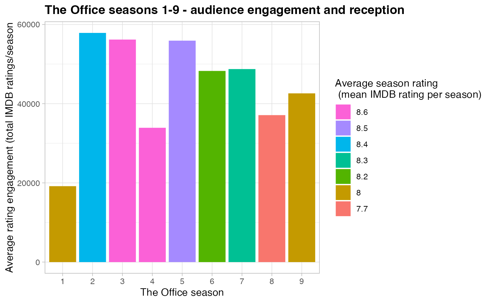

Tidy Tuesday 2020-03-17 - The Office - Words and Numbers
================
2/27/23

``` r
library(tidyverse)
theme_set(theme_light())

office_ratings <- readr::read_csv("https://raw.githubusercontent.com/rfordatascience/tidytuesday/master/data/2020/2020-03-17/office_ratings.csv")
```

``` r
#office_ratings
```

**1. Which episodes have the biggest amount of total votes and highest
rating?**

``` r
most_votes <-
  office_ratings |>
  select(season, title, total_votes) |>
  arrange(desc(total_votes)) |>
  head(10)

most_votes
```

| season | title                 | total_votes |
|-------:|:----------------------|------------:|
|      9 | Finale                |        7934 |
|      5 | Stress Relief         |        5948 |
|      7 | Goodbye, Michael      |        5749 |
|      4 | Dinner Party          |        4095 |
|      1 | Pilot                 |        3706 |
|      2 | Casino Night          |        3644 |
|      6 | Niagara: Part 1       |        3579 |
|      1 | Diversity Day         |        3566 |
|      7 | Threat Level Midnight |        3525 |
|      2 | The Injury            |        3282 |

``` r
highest_ratings <-
  office_ratings |>
  select(season, title, imdb_rating) |>
  arrange(desc(imdb_rating)) |>
  head(10)

highest_ratings
```

| season | title                 | imdb_rating |
|-------:|:----------------------|------------:|
|      7 | Goodbye, Michael      |         9.7 |
|      9 | Finale                |         9.7 |
|      5 | Stress Relief         |         9.6 |
|      2 | Casino Night          |         9.3 |
|      3 | The Job               |         9.3 |
|      4 | Dinner Party          |         9.3 |
|      4 | Goodbye, Toby         |         9.3 |
|      6 | Niagara: Part 1       |         9.3 |
|      6 | Niagara: Part 2       |         9.3 |
|      7 | Threat Level Midnight |         9.3 |

Based on these two tables, it is clear that the 3 highest rated episodes
were also the ones that attracted the most engagement on IMDB from the
audience (i.e., the total number of votes).

**2. What is the average rating of each season?**

``` r
audience_season_ratings <-
  office_ratings |>
  group_by(season) |>
  summarise(
    "number_of_episodes" = n_distinct(episode),
    "average_season_rating" = round(mean(imdb_rating), digits = 1)
  ) |>
  ungroup() |>
  arrange(desc(average_season_rating))

audience_season_ratings
```

| season | number_of_episodes | average_season_rating |
|-------:|-------------------:|----------------------:|
|      3 |                 23 |                   8.6 |
|      4 |                 14 |                   8.6 |
|      5 |                 26 |                   8.5 |
|      2 |                 22 |                   8.4 |
|      7 |                 24 |                   8.3 |
|      6 |                 26 |                   8.2 |
|      1 |                  6 |                   8.0 |
|      9 |                 23 |                   8.0 |
|      8 |                 24 |                   7.7 |

Based on this data, season 3 had the highest mean rating and season 8
had the lowest.

**3. How did the audience engagement on IMDB (total number of ratings)
on changed across the seasons?**

``` r
audience_engagement <-
  office_ratings |>
  group_by(season) |>
  summarise(
    "number_of_episodes" = n_distinct(episode),
    "average_rating_engagement" = sum(total_votes)
  ) |>
  arrange(desc(average_rating_engagement))

audience_engagement
```

| season | number_of_episodes | average_rating_engagement |
|-------:|-------------------:|--------------------------:|
|      2 |                 22 |                     57874 |
|      3 |                 23 |                     56193 |
|      5 |                 26 |                     55919 |
|      7 |                 24 |                     48743 |
|      6 |                 26 |                     48270 |
|      9 |                 23 |                     42610 |
|      8 |                 24 |                     37113 |
|      4 |                 14 |                     33916 |
|      1 |                  6 |                     19172 |

Based on the number of IMDB ratings, season 2 collected the most
ratings.

**4. How does average season rating compare to average audience
engagement on IMDB?**

``` r
audience_analysis <-
  inner_join(audience_season_ratings,
    audience_engagement,
    by = c("season", "number_of_episodes")
  ) |>
  arrange(season)

audience_analysis
```

| season | number_of_episodes | average_season_rating | average_rating_engagement |
|-------:|-------------------:|----------------------:|--------------------------:|
|      1 |                  6 |                   8.0 |                     19172 |
|      2 |                 22 |                   8.4 |                     57874 |
|      3 |                 23 |                   8.6 |                     56193 |
|      4 |                 14 |                   8.6 |                     33916 |
|      5 |                 26 |                   8.5 |                     55919 |
|      6 |                 26 |                   8.2 |                     48270 |
|      7 |                 24 |                   8.3 |                     48743 |
|      8 |                 24 |                   7.7 |                     37113 |
|      9 |                 23 |                   8.0 |                     42610 |

``` r
audience_analysis |>
  mutate(
    season = factor(season),
    average_season_rating = factor(average_season_rating)
  ) |>
  ggplot(aes(season, average_rating_engagement, fill = average_season_rating)) +
  geom_col() +
  expand_limits(x = 1:9) +
  labs(
    x = "The Office season",
    y = "Average rating engagement (total IMDB ratings/season",
    fill = "Average season rating\n (mean IMDB rating per season)",
    title = "The Office seasons 1-9 - audience engagement and reception"
  ) +
  theme(
    plot.title = element_text(face = "bold"),
    legend.position = "right"
  ) +
  scale_fill_discrete(guide = guide_legend(reverse = TRUE))
```



